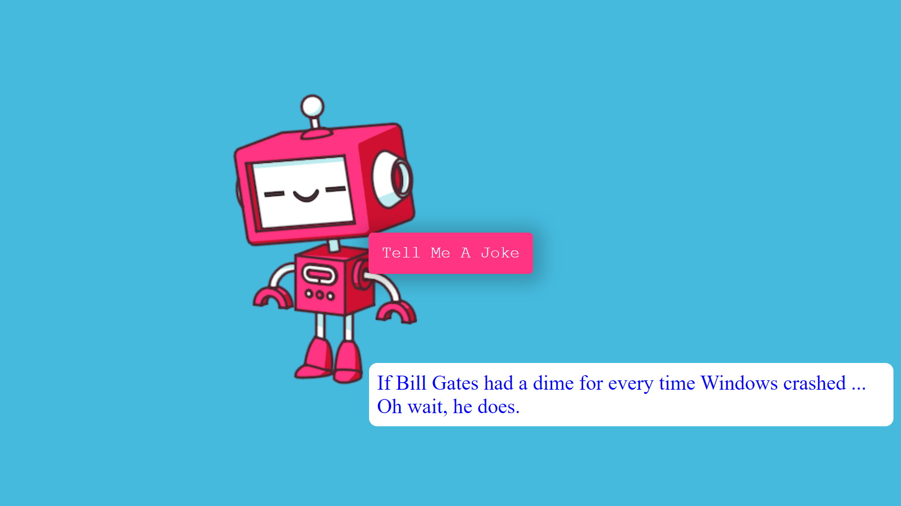

## JS Projects
This repository is designed to hold a collection of 20 JavaScript projects, which were undertaken as components of the course instructed by Andrei Neagoie and Jacinto Wong. All projects completed so far can be found [here](https://vermillion-puffpuff-312cf5.netlify.app).

### Quote Generator

[Live preview](https://vermillion-puffpuff-312cf5.netlify.app/01-quote-generator/)

Dynamic webpage that fetches quotes from an external API provided by [Jacinto Wong](https://github.com/JacintoDesign). It displays a random quote along with its author, and offers the option to generate a new quote or share the current one on Twitter. The page shows a loading animation while fetching quotes and employs responsive design to handle varying quote lengths.

### Infinity Scroll

[Live preview](https://vermillion-puffpuff-312cf5.netlify.app/02-infinity-scroll/)

Interactive webpage is built to display a grid of random images fetched from the [Unsplash API](https://unsplash.com/developers). As the user scrolls down the page, more images are loaded dynamically. A loader is displayed during the initial loading phase, and once images are loaded, they are presented in a responsive grid layout.

### Picture In Picture

[Live preview](https://vermillion-puffpuff-312cf5.netlify.app/03-picture-in-picture/)

Enable user to capture their screen using the [Screen Capture API](https://developer.mozilla.org/en-US/docs/Web/API/Screen_Capture_API/Using_Screen_Capture) and display it in a video element. It also offers a button to activate the Picture-in-Picture mode for the video, allowing the captured screen content to be displayed in a smaller, draggable window while continuing to use other applications. [useful article i followed](https://css-tricks.com/an-introduction-to-the-picture-in-picture-web-api/)

### Joke Teller

[Live preview](https://vermillion-puffpuff-312cf5.netlify.app/04-joke-teller/)

