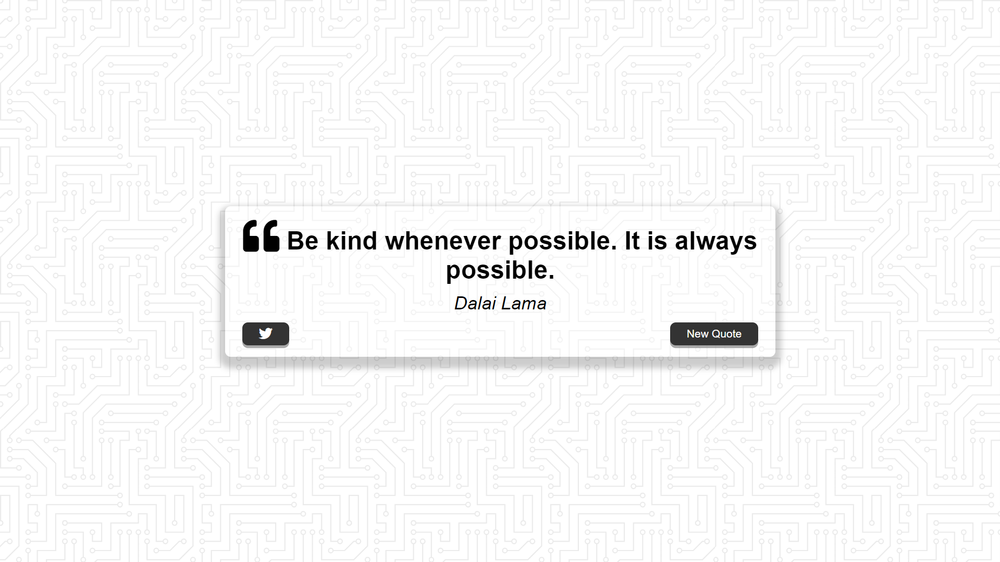
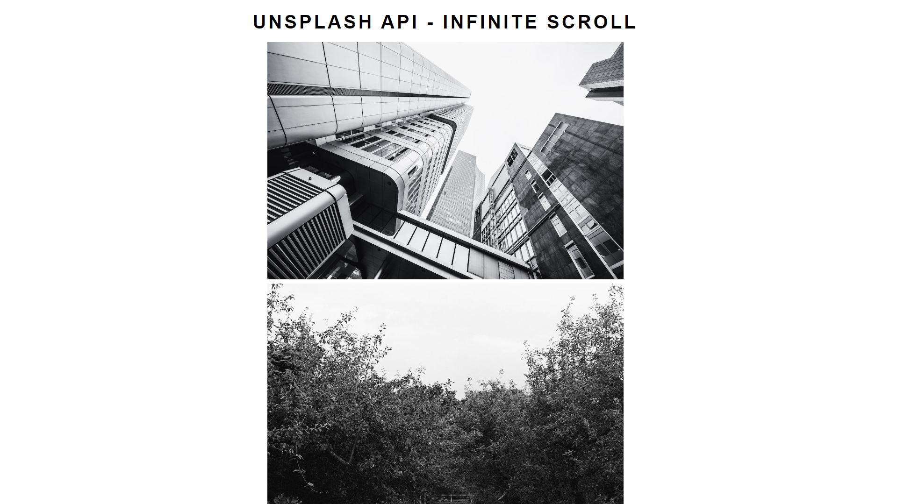
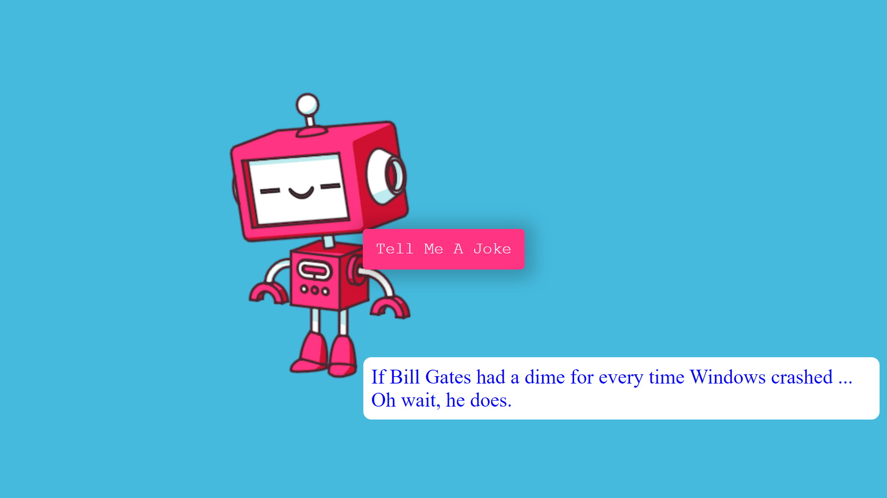
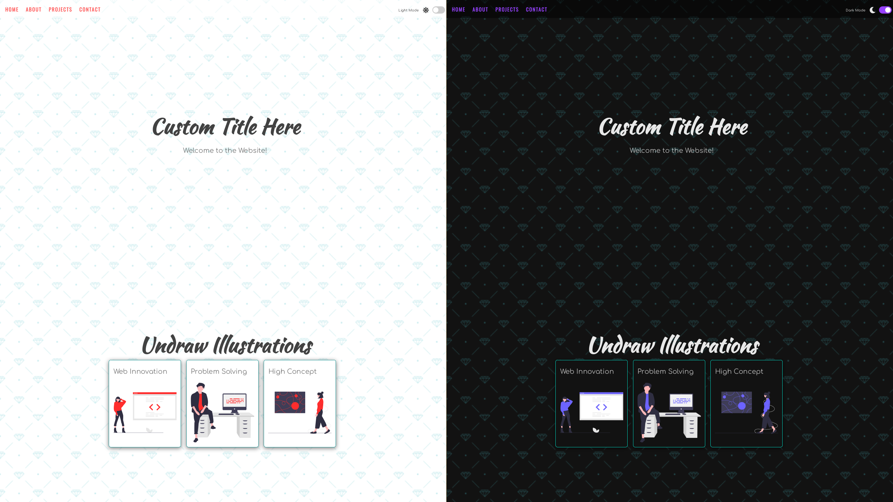
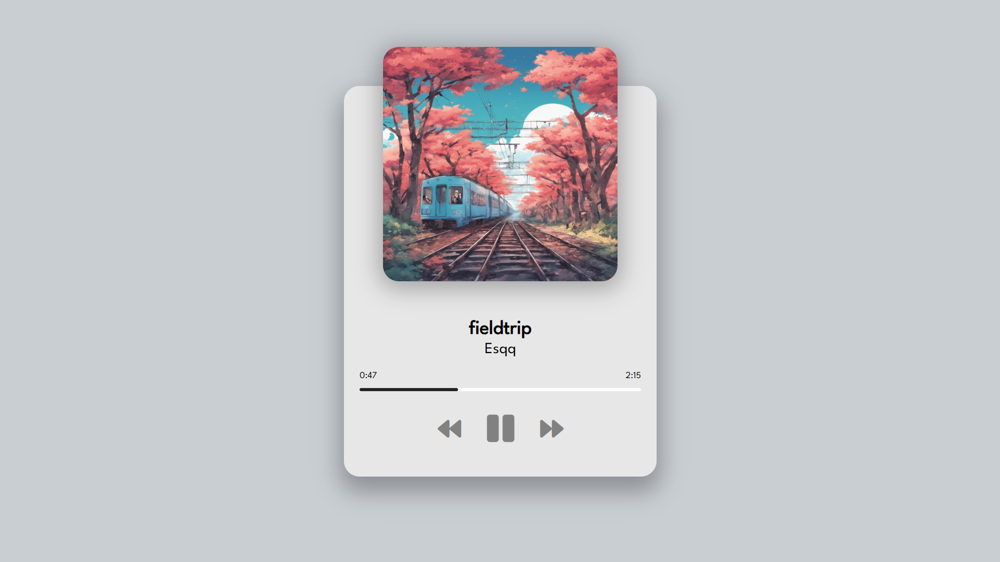

## JS Projects
This repository is designed to hold a collection of 20 JavaScript projects, which were undertaken as components of the course instructed by Andrei Neagoie and Jacinto Wong. Designs from [heropatterns](https://heropatterns.com) are frequently used in these projects, borders used in demo are borrowed from [this codepen](https://codepen.io/t_afif/pen/eYeqvMe).

:rocket: [DEMO](https://vermillion-puffpuff-312cf5.netlify.app)

### Table of Contents
1. [Quote Generator](#quote-generator)
2. [Infinity Scroll](#infinity-scroll)
3. [Picture In Picture](#picture-in-picture)
4. [Joke Teller](#joke-teller)
5. [Dark Mode](#dark-mode)
6. [Animated Template](#animated-template)
7. [Animated Navigation](#animated-navigation)
8. [Music Player](#music-player)
9. [Custom Countdown](#custom-countdown)

### Quote Generator

:rocket: [Live preview](https://vermillion-puffpuff-312cf5.netlify.app/01-quote-generator/)

Fetches quotes from API by [Jacinto Wong](https://github.com/JacintoDesign), displaying random quotes with authors and enabling quote generation and sharing on Twitter.

### Infinity Scroll

:rocket: [Live preview](https://vermillion-puffpuff-312cf5.netlify.app/02-infinity-scroll/)

Displays a grid of random images from the [Unsplash API](https://unsplash.com/developers) that load dynamically as users scroll.

### Picture In Picture

:rocket: [Live preview](https://vermillion-puffpuff-312cf5.netlify.app/03-picture-in-picture/)

Allows users to capture and display their screen using the [Screen Capture API](https://developer.mozilla.org/en-US/docs/Web/API/Screen_Capture_API/Using_Screen_Capture) in a resizable Picture-in-Picture window while continuing to use other applications. [nice article i followed](https://css-tricks.com/an-introduction-to-the-picture-in-picture-web-api/)

### Joke Teller

:rocket: [Live preview](https://vermillion-puffpuff-312cf5.netlify.app/04-joke-teller/)

Fetches programming-related jokes from the [Joke API](https://sv443.net/jokeapi/v2/), converting them to audio using the [VoiceRSS API](https://www.voicerss.org/api/) for playback.

### Dark Mode

:rocket: [Live preview](https://vermillion-puffpuff-312cf5.netlify.app/05-light-dark-mode/)

Dynamic theme switcher to toggle between light and dark modes by clicking a checkbox. Chosen theme remains after reloading the page through local storage.

### Animated Template

:rocket: [Live preview](https://vermillion-puffpuff-312cf5.netlify.app/06-animated-template/)

Animated landing page made using a starter kit from [Creative Tim](https://www.creative-tim.com/learning-lab/tailwind-starter-kit/landing) and [Animate On Scroll Library](https://github.com/michalsnik/aos) (AOS) from michalsnik.

### Animated Navigation

:rocket: [Live preview](https://vermillion-puffpuff-312cf5.netlify.app/07-animated-navigation/)

Dynamic navigation menu with smooth animations and a toggleable overlay. Navigation items slide in and out gracefully when clicked.

### Music Player

:rocket: [Live preview](https://vermillion-puffpuff-312cf5.netlify.app/08-music-player/)

A functional Music Player with play, pause, and track navigation capabilities. Includes dynamic progress tracking and displays artist album art.

### Custom Countdown

:rocket: [Live preview](https://vermillion-puffpuff-312cf5.netlify.app/09-custom-countdown/)

A customizable countdown timer designed for tracking personal events. Utilizes local storage to save event details, ensuring your countdowns persist between sessions.

### Book Keeper

TBA ; - D
